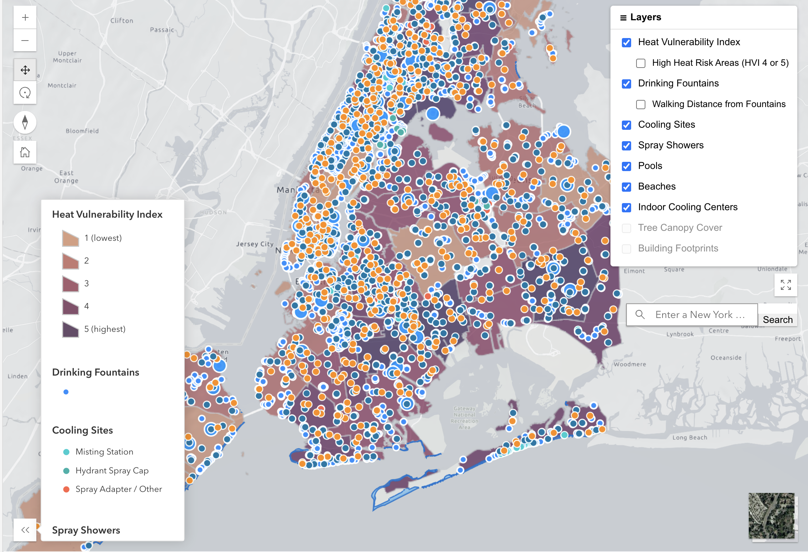

# NYC Heat Planning Web App

## 1. Overview

A browser-based spatial decision support tool that helps New York City planners visualize urban heat exposure, identify cooling resources, and analyze building shadow coverage. Intended for city planners and urban heat resilience professionals.

**Live app:** [https://omarc200.github.io/Heat_Mapping/](https://omarc200.github.io/Heat_Mapping/)

---

## 2. Screenshots




---

## 3. Features

- **2D/3D view toggling** with animated camera transitions (tilt, heading) and automatic 3D building visibility.
- **Shadow Cast tool:** cumulative shadow duration analysis over a configurable time window (8 AM – 6 PM, July 21).
- **Daylight Animation tool:** real-time shadow scrubbing and playback across the day.
- **Toggleable data layers** via a collapsible layer control panel with logical grouping.
- **Heat Vulnerability Index** with an optional high-risk filter (HVI >= 4).
- **Drinking fountain quarter-mile walking distance buffer** (client-side dissolved geodesic buffer).
- **Collapsible map legend** that auto-hides in 3D mode and when no 2D layers are visible.
- **Address geosearch** constrained to New York City via the ArcGIS World Geocoding Service.
- **Basemap switching** (default gray-vector with satellite toggle).
- **Fullscreen mode.**
- **Scale-dependent layer behavior:** checkboxes are greyed out with a tooltip when the map is zoomed out beyond a layer's visibility threshold.
- **Popups on feature click** for all data layers.
- **Custom home button** that preserves camera tilt/heading in 3D mode.
- **Clear All Layers button** to reset all layer visibility at once.

---

## 4. Technology Stack

| Technology | Details |
|---|---|
| ArcGIS Maps SDK for JavaScript | v4.34, loaded via CDN (not npm). Uses the AMD `require()` module pattern. |
| ArcGIS Map Components | Web components for Shadow Cast (`arcgis-shadow-cast`) and Daylight (`arcgis-daylight`). Loaded from the v4.34 CDN endpoint. |
| Calcite Design System | v3.3.3. Required by ArcGIS Map Components. Loaded via CDN. |
| HTML / CSS / JavaScript | Vanilla — no framework (no React, no Angular, no build tools). Single-page application. |
| Hosting | GitHub Pages, served from the `main` branch. |

> **Important:** There is no `npm`, no build step, and no bundler. Everything loads via CDN `<script>` tags. Simply open the HTML file through a local web server — no installation required.

---

## 5. File Structure

| File / Folder | Purpose |
|---|---|
| `index.html` | Page structure: map container, sidebar with 2D/3D toggle and 3D shadow tool radio buttons, CDN script/link tags. |
| `css/styles.css` | All custom styling: sidebar layout, layer panel, 3D tools panel, legend container, `layer-row-disabled` state, responsive rules. |
| `js/app.js` | All application logic: layer definitions, map/view initialization, layer control panel construction, widget setup, fountain buffer generation, shadow tool management, 2D/3D toggle, legend management. |
| `assets/` | Local data files: `pools_points.geojson`. Used by `GeoJSONLayer`. |
| `docs/` | Documentation assets (screenshots, user manual — if stored here). |
| `README.md` | This project documentation file. |

> The app is a single-page application with all logic consolidated in one JavaScript file (`app.js`). This was a deliberate choice given the project's scope and team experience level.

---

## 6. Data Sources

| Layer Name | Layer Type | URL / Source | Filter |
|---|---|---|---|
| Heat Vulnerability Index | FeatureLayer | `https://services2.arcgis.com/IsDCghZ73NgoYoz5/arcgis/rest/services/HVIbyCommunityDistrict_ForWeb/FeatureServer/0` | Optional: `HVI >= 4` (high-risk filter) |
| Beaches | FeatureLayer | `https://services5.arcgis.com/GfwWNkhOj9bNBqoJ/ArcGIS/rest/services/nyc_beaches/FeatureServer/1` | None |
| Building Footprints | FeatureLayer | `https://services6.arcgis.com/yG5s3afENB5iO9fj/arcgis/rest/services/BUILDING_view/FeatureServer/0` | None |
| Tree Canopy Cover | FeatureLayer | `https://services3.arcgis.com/xJHn8F2NTtwCMFtX/ArcGIS/rest/services/TreeCanopy2017_Simplified_1ft/FeatureServer/0` | None |
| Drinking Fountains | FeatureLayer | `https://services6.arcgis.com/yG5s3afENB5iO9fj/ArcGIS/rest/services/NYC_Parks_Drinking_Fountains/FeatureServer/0` | None |
| Fountain Walking Distance Buffer | GraphicsLayer | Generated client-side from Drinking Fountains layer using `geometryEngineAsync.geodesicBuffer` (402 m / 0.25 mi, dissolved) | N/A |
| Cooling Sites | FeatureLayer | `https://services2.arcgis.com/ZpsvDOsGv97WuKRh/arcgis/rest/services/Cool_it_Cooling_Sites/FeatureServer/0` | None |
| Spray Showers | FeatureLayer | `https://services6.arcgis.com/yG5s3afENB5iO9fj/ArcGIS/rest/services/Cool_Options/FeatureServer/0` | `Space_type = 'Spray Shower'` |
| Indoor Cooling Centers | FeatureLayer | `https://services6.arcgis.com/yG5s3afENB5iO9fj/ArcGIS/rest/services/Cool_Options/FeatureServer/0` | `Space_type = 'Cooling Center'` |
| Pools | GeoJSONLayer | Local file: `assets/pools_points.geojson` | None |
| Open 3D Buildings | SceneLayer | `https://basemaps3d.arcgis.com/arcgis/rest/services/Open3D_Buildings_v1/SceneServer` | None (internal use only; not in layer panel) |

> **Note:** Spray Showers and Indoor Cooling Centers share the same REST endpoint (`Cool_Options/FeatureServer/0`) but are separated into distinct layers using different `definitionExpression` filters. This is intentional — both layers represent different facility types within the same service.

---

## 7. ArcGIS SDK Modules Used

### AMD Modules (loaded via `require()`)

| Module | Purpose |
|---|---|
| `esri/Map` | Core map object that holds all layers. |
| `esri/views/SceneView` | 3D-capable map view (used for both 2D and 3D modes; 2D is achieved by setting tilt to 0). |
| `esri/widgets/Home` | Custom home button that returns to the default NYC extent. |
| `esri/widgets/Fullscreen` | Fullscreen toggle widget. |
| `esri/layers/SceneLayer` | Open 3D Buildings layer. |
| `esri/layers/FeatureLayer` | All ArcGIS REST-hosted data layers (HVI, Beaches, Building Footprints, Tree Canopy, Fountains, Cooling Sites, Spray Showers, Cooling Centers). |
| `esri/widgets/BasemapToggle` | Toggle between gray-vector and satellite basemaps. |
| `esri/layers/GeoJSONLayer` | Pools layer (loaded from local GeoJSON file). |
| `esri/layers/GraphicsLayer` | Fountain walking distance buffer (client-side generated geometry). |
| `esri/Graphic` | Individual graphic object added to the buffer GraphicsLayer. |
| `esri/geometry/geometryEngineAsync` | Async geodesic buffer calculation for the fountain quarter-mile walking distance. |
| `esri/widgets/Legend` | Per-layer legend instances assembled in a custom container for controlled display order. |
| `esri/widgets/Expand` | Collapsible wrapper for the legend container. |
| `esri/widgets/Search` | Address geosearch widget. |
| `esri/widgets/Search/LocatorSearchSource` | Configures the Search widget to use the ArcGIS World Geocoding Service, constrained to NYC by bounding box. |

### Web Components (loaded via `<script type="module">`)

- **`arcgis-shadow-cast`** — Shadow Cast visualization component. Destroyed and recreated each time the user activates it (no reliable SDK API to clear the overlay otherwise).
- **`arcgis-daylight`** — Daylight animation component. Created once with `autoDestroyDisabled = true` and reused across activations; removed from the DOM when not active but never destroyed.

---

## 8. Layer Draw Order

Layers are added to the `map.layers` array in a specific sequence so that polygon layers are drawn beneath point layers. This ensures point features remain visible and clickable when multiple layers are active.

Draw order from bottom (drawn first) to top (drawn last):

1. Heat Vulnerability Index (polygon)
2. Beaches (polygon)
3. Building Footprints (polygon)
4. Tree Canopy Cover (polygon)
5. Fountain Walking Distance Buffer (polygon, GraphicsLayer)
6. Drinking Fountains (point)
7. Cooling Sites (point)
8. Spray Showers (point)
9. Indoor Cooling Centers (point)
10. Pools (point)

The Open 3D Buildings SceneLayer is added last in the layers array but is toggled independently by the 2D/3D switch and does not appear in the layer control panel.

---

## 9. How Data Is Loaded and Processed

- **Direct REST loading:** Most layers (HVI, Beaches, Building Footprints, Tree Canopy, Fountains, Cooling Sites, Spray Showers, Cooling Centers) load directly from public ArcGIS REST feature service endpoints at runtime. No local data processing or transformation is performed — the SDK handles feature requests, caching, and rendering.
- **Local GeoJSON:** The Pools layer loads from a local GeoJSON file (`assets/pools_points.geojson`) via `GeoJSONLayer`. The file is stored in the repository and served alongside the app.
- **Client-side buffer generation:** The fountain walking distance buffer is generated entirely in the browser. On view load, the app paginates through all fountain features (querying 1,000 at a time to handle the service's `maxRecordCount` limit), then runs `geometryEngineAsync.geodesicBuffer()` with a 402-meter radius (approximately one quarter mile) and the dissolve flag set to `true`. The resulting single dissolved polygon is added to a `GraphicsLayer`.
- **Definition expressions:** Spray Showers and Indoor Cooling Centers are filtered from the same `Cool_Options` service using `definitionExpression` properties, which apply a SQL `WHERE` clause on the server side before features are returned to the client.
- **Elevation handling:** Polygon layers like Beaches use `elevationInfo: { mode: 'on-the-ground' }` to prevent Z-coordinate rendering issues in the SceneView, which would otherwise pin polygons at sea level (z = 0).

---

## 10. Known Limitations, Performance Considerations, and Issues

### 10a. Performance

- **Scale thresholds:** Tree Canopy Cover and Building Footprints both use `minScale: 25000` because they contain very large numbers of features that cause severe performance degradation at citywide zoom levels. The layers only begin loading when the user zooms in past this threshold.
- **Fountain buffer load time:** The client-side buffer generation requires querying all fountain features (several thousand) and running a geodesic buffer calculation. This takes several seconds after the view first loads. The buffer layer is not available until this completes.
- **Scale-dependent UI feedback:** When the map is zoomed out beyond a layer's `minScale`, the corresponding checkbox in the layer panel is disabled and greyed out, and a tooltip reads "Zoom in to enable this layer." This prevents users from toggling layers that would not render at the current zoom.

### 10b. 3D Mode Constraints

- **Shadow Cast destroy/recreate pattern:** The ArcGIS SDK v4.34 provides no reliable way to hide or clear the Shadow Cast overlay once it has been rendered. The workaround is to destroy the `arcgis-shadow-cast` component entirely when the user deselects it, and recreate a fresh instance when they select it again.
- **Daylight persistence:** Unlike Shadow Cast, the `arcgis-daylight` component is created once with `autoDestroyDisabled = true` and reused across activations. It is removed from the DOM when not active but not destroyed.
- **2D polygon layers in 3D mode:** 2D polygon layers draped on the ground surface can obscure the shadow rendering. Programmatic hiding of these layers in 3D mode is partially implemented — behavior may vary depending on which layers are active when switching to 3D.
- **Legend auto-hides in 3D:** The legend Expand widget is hidden in 3D mode since the 2D analytical layers are not the focus of the 3D view.

### 10c. Authentication

- **No API key / OAuth:** The application currently operates without an ArcGIS API key or OAuth token. All data layers use public REST endpoints that do not require authentication. The Open 3D Buildings SceneLayer from Esri's Living Atlas has shown one unreproducible instance of empty tiles, which may be related to AGOL subscription/auth requirements — this is being monitored.

### 10d. Browser Compatibility

- Tested in **Chrome** and **Firefox**. Chrome is the recommended browser for best 3D/WebGL performance.
- Safari has known WebGL limitations that may affect 3D shadow rendering — use Chrome or Firefox for the 3D tools.
- The app requires a browser with WebGL support for the SceneView. Most modern desktop browsers qualify.

### 10e. Other Known Issues

- A `view.watch('scale')` console logger is still present in `app.js`. It was left intentionally during development and can be removed before final release.
- Any additional known bugs should be documented here with their status (e.g., deferred, in progress, won't fix) as they are identified.

---

## 11. How to Run Locally

No installation or build step is required. All dependencies load via CDN.

1. **Clone the repository:**
   ```bash
   git clone https://github.com/omarc200/Heat_Mapping.git
   ```

2. **Navigate to the project folder:**
   ```bash
   cd Heat_Mapping
   ```

3. **Serve the project using a local web server.** Two easy options:
   - **VS Code with Live Server extension:** Right-click `index.html` and select "Open with Live Server."
   - **Python:** Run the following command, then open `http://localhost:8000` in your browser:
     ```bash
     python -m http.server 8000
     ```

4. **Open the app in Chrome or Firefox.**

> **Important:** The app must be served via HTTP — do not open `index.html` directly as a local file (`file://`). The ArcGIS SDK CDN scripts require a proper HTTP origin. An internet connection is required at all times because all map tiles, feature services, and SDK code are fetched from remote servers.

---

## 12. Deployment

The application is deployed via **GitHub Pages** from the `main` branch.

- **Live URL:** [https://omarc200.github.io/Heat_Mapping/](https://omarc200.github.io/Heat_Mapping/)
- Any push to the `main` branch automatically triggers a GitHub Pages rebuild and deployment.
- The typical delay between a push and the live update is under 2 minutes.

---

## 13. Team and Credits

### Team Members

| Name | Role |
|---|---|
| Carlo Davis | Product Manager |
| Dayvian Pena | Software Engineer |
| Boris Manzi | Software Engineer |
| Omar Alvarez | Software Engineer |

### Data Sources

- **NYC Open Data / NYC Parks** — Drinking Fountains, Spray Showers, Cooling Centers, Building Footprints, Beaches
- **ArcGIS Living Atlas / Esri** — Open 3D Buildings, Heat Vulnerability Index (NYC community district data), Cooling Sites (Cool It! program)
- **NYC Parks / Urban Forestry** — Tree Canopy Cover (2017)
- **NYC Office of Emergency Management** — Cooling Center data

### Acknowledgments

- [ArcGIS Maps SDK for JavaScript](https://developers.arcgis.com/javascript/latest/) — documentation and code samples
- **Project Supervisor:** Maddalena Romano
