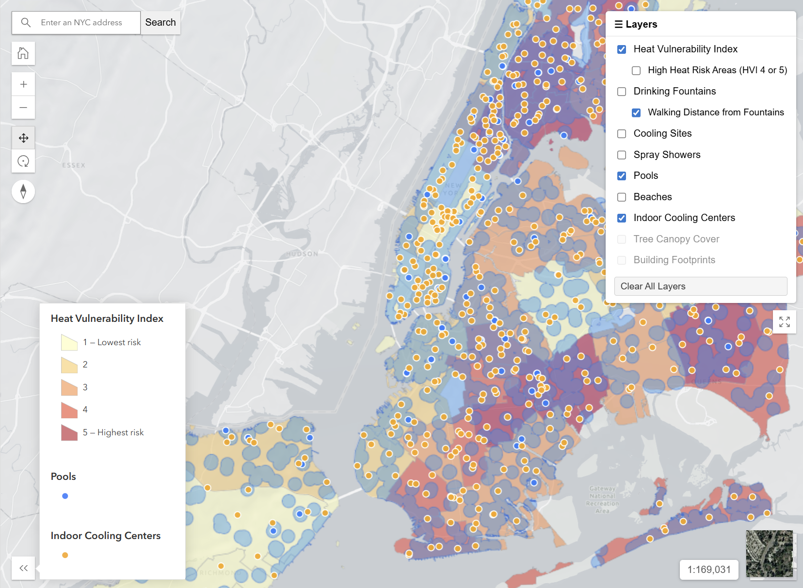
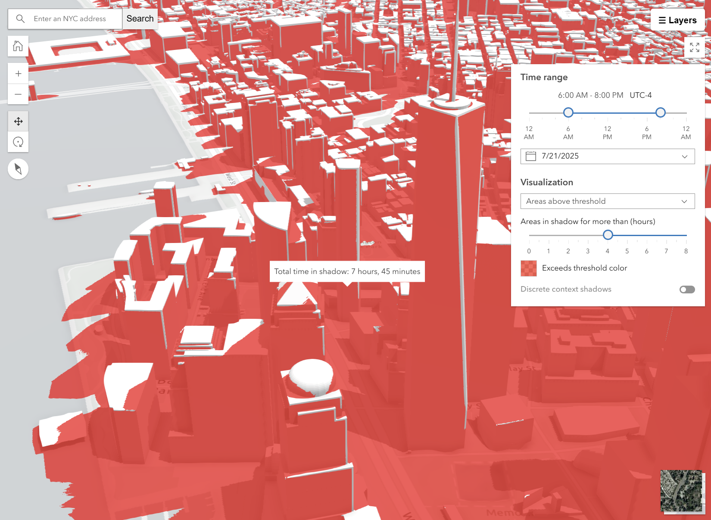

# NYC Heat Planning Web App

## 1. Overview

A browser-based spatial decision support tool that helps New York City planners visualize urban heat exposure, identify cooling resources, and analyze building shadow coverage. Intended for city planners and urban heat resilience professionals.

**Live app:** [https://omarc200.github.io/Heat_Mapping/](https://omarc200.github.io/Heat_Mapping/)

---

## 2. Screenshots





---

## 3. Features

- **2D/3D view toggling** with animated camera transitions (tilt, heading) and automatic 3D building visibility.
- **Shadow Cast tool:** cumulative shadow duration analysis over a configurable time window (default is 6 AM – 8 PM on July 21, 2025).
- **Daylight Animation tool:** real-time shadow animation scrubbing and playback across the day.
- **Toggleable 2D data layers** via a collapsible layer control panel with logical grouping (heat risk layer first, followed by layers representing heat risk mitigation features).
- **Heat Vulnerability Index** layer with citywide coverage and an optional filter for high heat risk areas (HVI >= 4).
- **Drinking fountain walking distance (quarter-mile) buffer** (client-side dissolved geodesic buffer clipped to areas of land in New York City).
- **Collapsible map legend** that dynamically reflects whichever 2D layers are active and auto-hides in 3D mode or when no 2D layers are visible.
- **Address geosearch** biased to New York City via the ArcGIS World Geocoding Service.
- **Basemap switching toggle** (default gray vector basemap with satellite imagery mosaic as alternate option).
- **Fullscreen mode.**
- **Scale-dependent layer behavior:** 2D layers with high feature counts (Tree Canopy and Building Footprints) can only be viewed at a 1:25,000 scale or finer. Above this scale threshold, their layer checkboxes are disabled with a warning tooltip.
- **Scale indicator widget** that indicates current map scale as ratio and auto-hides in 3D mode (native ArcGIS scale bar widget is not supported in ArcGIS SceneView configuration, which must be used to support 3D mode).
- **Popups on feature click** that provide feature-level information for most 2D data layers, including a click-to-identify popup on the Drinking Fountain Walking Distance Buffer.
- **Custom home button** that preserves camera tilt/heading in 3D mode.
- **Clear All Layers button** to reset all layer visibility at once.
- **User Manual link** in the sidebar that opens a standalone user manual page in a new tab.

---

## 4. Technology Stack

| Technology | Details |
|---|---|
| ArcGIS Maps SDK for JavaScript | JS loaded from `https://js.arcgis.com/4.34/` via CDN (not npm). Uses the AMD `require()` module pattern. The CSS theme is loaded separately from `https://js.arcgis.com/4.29/esri/themes/light/main.css` — the JS and CSS versions intentionally differ; this is not a typo. |
| ArcGIS Map Components | Web components for Shadow Cast (`arcgis-shadow-cast`) and Daylight (`arcgis-daylight`). Loaded from the v4.34 CDN endpoint. |
| Calcite Design System | v3.3.3. Required by ArcGIS Map Components. Loaded via CDN. |
| HTML / CSS / JavaScript | Vanilla — no framework (no React, no Angular, no build tools). Single-page application. |
| Hosting | GitHub Pages, served from the `main` branch. |

> **Important:** There is no `npm`, no build step, and no bundler. Everything loads via CDN `<script>` tags. Simply open the HTML file through a local web server — no installation required.

---

## 5. File Structure

| File / Folder | Purpose |
|---|---|
| `index.html` | Page structure: map container, sidebar with 2D/3D toggle, 3D shadow tool radio buttons, explanatory text for app, and CDN script/link tags. |
| `user-manual.html` | Standalone HTML page containing the full user manual for the app — overview, instructions, screenshots, and reference content. Opened in a new tab from the "User Manual" link in `index.html`'s sidebar. |
| `css/styles.css` | All custom styling: sidebar layout (fluid width via `clamp()`), layer panel, 3D tools panel, legend container, and the `layer-row-disabled` state used when a layer is past its `minScale` threshold. |
| `js/app.js` | All application logic: layer definitions, map/view initialization, layer control panel construction, widget setup, fountain buffer generation, shadow tool management, 2D/3D toggle, legend management. |
| `assets/` | Local files served alongside the app. Contains `pools_points.geojson` (the source for the Pools `GeoJSONLayer`) and the README screenshot images (`screenshot-2d-layers.png`, `screenshot-3d-shadow-cast.png`). |
| `docs/` | Internal QA documents: `Testing Checklist.docx`, `QA Checklist.docx`, and `checklist.md`. |
| `README.md` | This project documentation file. |
| `LICENSE` | Open-source license for the project. |

> The app is a single-page application with all logic consolidated in one JavaScript file (`app.js`). This was a deliberate choice given the project's scope and team experience level.

---

## 6. Data Sources

| Layer Name | Layer Type | URL / Source | Filter |
|---|---|---|---|
| Heat Vulnerability Index | FeatureLayer | `https://services2.arcgis.com/IsDCghZ73NgoYoz5/arcgis/rest/services/HVIbyCommunityDistrict_ForWeb/FeatureServer/0` | Optional: `HVI >= 4` (high-risk filter) |
| Beaches | FeatureLayer | `https://services5.arcgis.com/GfwWNkhOj9bNBqoJ/ArcGIS/rest/services/nyc_beaches/FeatureServer/1` | None |
| Building Footprints | FeatureLayer | `https://services6.arcgis.com/yG5s3afENB5iO9fj/arcgis/rest/services/BUILDING_view/FeatureServer/0` | None |
| Tree Canopy Cover | FeatureLayer | `https://services3.arcgis.com/xJHn8F2NTtwCMFtX/ArcGIS/rest/services/TreeCanopy2017_Simplified_1ft/FeatureServer/0` | None |
| Drinking Fountains | FeatureLayer | `https://services6.arcgis.com/yG5s3afENB5iO9fj/ArcGIS/rest/services/NYC_Parks_Drinking_Fountains/FeatureServer/0` | None |
| Drinking Fountain Walking Distance Buffer | GraphicsLayer | Generated client-side from Drinking Fountains layer using `geometryEngineAsync.geodesicBuffer` (402 m / 0.25 mi, dissolved, then clipped to just areas of land in NYC using union of Community Districts from HVI layer) | N/A |
| Cooling Sites | FeatureLayer | `https://services2.arcgis.com/ZpsvDOsGv97WuKRh/arcgis/rest/services/Cool_it_Cooling_Sites/FeatureServer/0` | None |
| Spray Showers | FeatureLayer | `https://services6.arcgis.com/yG5s3afENB5iO9fj/ArcGIS/rest/services/Cool_Options/FeatureServer/0` | `Space_type = 'Spray Shower'` |
| Indoor Cooling Centers | FeatureLayer | `https://services6.arcgis.com/yG5s3afENB5iO9fj/ArcGIS/rest/services/Cool_Options/FeatureServer/0` | `Space_type IN ('Cooling Center', 'Other Indoor Cool Option')` |
| Pools | GeoJSONLayer | Local file: `assets/pools_points.geojson` | None |
| Open 3D Buildings | SceneLayer | `https://basemaps3d.arcgis.com/arcgis/rest/services/Open3D_Buildings_v1/SceneServer` | None (internal use only; not in layer panel) |

> **Note:** Spray Showers and Indoor Cooling Centers share the same REST endpoint (`Cool_Options/FeatureServer/0`) but are separated into distinct layers using different `definitionExpression` filters. This is intentional — both layers represent different facility types within the same service.

---

## 7. ArcGIS SDK Modules Used

### AMD Modules (loaded via `require()`)

| Module | Purpose |
|---|---|
| `esri/Map` | Core map object that holds all layers. |
| `esri/views/SceneView` | 3D-capable map view (used for both 2D and 3D modes; 2D is achieved by setting tilt to 0). |
| `esri/widgets/Fullscreen` | Fullscreen toggle widget. |
| `esri/layers/SceneLayer` | Open 3D Buildings layer. |
| `esri/layers/FeatureLayer` | All ArcGIS REST-hosted data layers (HVI, Beaches, Building Footprints, Tree Canopy, Fountains, Cooling Sites, Spray Showers, Cooling Centers). |
| `esri/widgets/BasemapToggle` | Toggle between gray-vector and satellite basemaps. |
| `esri/layers/GeoJSONLayer` | Pools layer (loaded from local GeoJSON file). |
| `esri/layers/GraphicsLayer` | Fountain walking distance buffer (client-side generated geometry). |
| `esri/Graphic` | Individual graphic object added to the buffer GraphicsLayer. |
| `esri/geometry/geometryEngineAsync` | Async geodesic buffer calculation for the fountain quarter-mile walking distance. |
| `esri/widgets/Legend` | Per-layer legend instances assembled in a custom container for controlled display order. |
| `esri/widgets/Expand` | Collapsible wrapper for the legend container. |
| `esri/widgets/Search` | Address geosearch widget. |
| `esri/widgets/Search/LocatorSearchSource` | Configures the Search widget to use the ArcGIS World Geocoding Service, biased to NYC via a `searchExtent` bounding box (strong preference, not a hard cutoff). |

> **Note on the home button:** The home button is **not** an instance of `esri/widgets/Home`. It is a hand-built `<div>` styled with ESRI's CSS classes (`esri-component esri-widget--button esri-widget esri-interactive` plus `esri-icon-home`). This was done so the click handler can preserve the user's current camera tilt and heading when in 3D mode, rather than snapping back to a default top-down extent the way the stock Home widget would.

### Web Components (loaded via `<script type="module">`)

- **`arcgis-shadow-cast`** — Shadow Cast visualization component. Destroyed and recreated each time the user activates it (no reliable SDK API to clear the overlay otherwise).
- **`arcgis-daylight`** — Daylight animation component. Created once with `autoDestroyDisabled = true` and reused across activations; removed from the DOM when not active but never destroyed.

---

## 8. Layer Draw Order

Layers are added to the `map.layers` array in a specific sequence so that polygon layers are drawn beneath point layers. This ensures point features remain visible and clickable when multiple layers are active.

Draw order from bottom (drawn first) to top (drawn last):

1. Heat Vulnerability Index (polygon)
2. Beaches (polygon)
3. Building Footprints (polygon)
4. Tree Canopy Cover (polygon)
5. Fountain Walking Distance Buffer (polygon, GraphicsLayer)
6. Cooling Sites (point)
7. Spray Showers (point)
8. Indoor Cooling Centers (point)
9. Pools (point)
10. Drinking Fountains (point)

Drinking Fountains is positioned last on purpose because it is the primary planning focus of the app — the intent is for fountain markers to render above every other 2D feature. In practice, the `SceneView` rendering pipeline does not strictly honor the `map.layers` order for point markers once layers are toggled on mid-session: a point layer activated *after* Drinking Fountains will render on top of it. See *Known Issues* below.

The Open 3D Buildings SceneLayer is added last in the layers array but is toggled independently by the 2D/3D switch and does not appear in the layer control panel.

---

## 9. How Data Is Loaded and Processed

- **Direct REST loading:** Most layers (HVI, Beaches, Building Footprints, Tree Canopy, Fountains, Cooling Sites, Spray Showers, Cooling Centers) load directly from public ArcGIS REST feature service endpoints at runtime. No local data processing or transformation is performed — the SDK handles feature requests, caching, and rendering.
- **Local GeoJSON:** The Pools layer loads from a local GeoJSON file (`assets/pools_points.geojson`) via `GeoJSONLayer`. The file is stored in the repository and served alongside the app.
- **Client-side buffer generation:** The fountain walking distance buffer is generated entirely in the browser. On view load, the app runs the following pipeline:
  1. Paginate through every fountain feature (querying 1,000 at a time to handle the service's `maxRecordCount` limit) via `fetchAllFountainGeoms`.
  2. In parallel, paginate through every Heat Vulnerability Index community-district polygon via `fetchAllHVIGeoms`.
  3. `geometryEngineAsync.geodesicBuffer(fountainGeoms, 402, "meters", true)` produces a single dissolved buffer polygon (402 m ≈ one quarter mile).
  4. `geometryEngineAsync.union(hviGeoms)` merges the HVI polygons into a single NYC land geometry.
  5. `geometryEngineAsync.intersect(buffer, nycLand)` clips the dissolved buffer to land only, so the buffer never bleeds into open water.
  6. The clipped polygon is added to a `GraphicsLayer` as a single `Graphic`.
- **Definition expressions:** Spray Showers and Indoor Cooling Centers are filtered from the same `Cool_Options` service using `definitionExpression` properties, which apply a SQL `WHERE` clause on the server side before features are returned to the client.
- **Elevation handling:** The **Beaches** layer is the only polygon layer that sets `elevationInfo: { mode: 'on-the-ground' }`. Without this, the SceneView defaults to absolute-height rendering for features that carry Z coordinates, which pins the polygons at z = 0 (sea level) and causes inland portions to render below the terrain. The other polygon layers (HVI, Building Footprints, Tree Canopy, Fountain buffer) do not need this override and do not set `elevationInfo`.

---

## 10. Known Limitations, Performance Considerations, and Issues

### 10a. Performance

- **Scale thresholds:** Tree Canopy Cover and Building Footprints both use `minScale: 25000` because they contain very large numbers of features that cause severe performance degradation at citywide zoom levels. The layers only begin loading when the user zooms in past this threshold.
- **Fountain buffer load time:** The client-side buffer generation requires querying all fountain features (several thousand) and running a geodesic buffer calculation. This takes several seconds after the view first loads. The buffer layer is not available until this completes.
- **Scale-dependent UI feedback:** When the map is zoomed out beyond a layer's `minScale`, the corresponding checkbox in the layer panel is disabled and greyed out, and a tooltip reads "Zoom in to enable this layer." This prevents users from toggling layers that would not render at the current zoom.
- **Tree Canopy Cover renders donut polygons as filled at all but the most zoomed-in scales.** The Tree Canopy dataset contains many polygon features with interior holes (e.g., a tree canopy ring surrounding an open clearing). At the zoom levels where the layer is served from cached/simplified WebGL vector tiles, the tile generation pipeline drops the interior rings, so the polygons render as fully filled rather than as donuts. The only known fix is to bypass vector-tile caching and query/serve all 1M+ polygons individually on every map move, which would severely degrade the layer's performance — Tree Canopy is already the least performant layer in the app, though within the realm of acceptability. **Status: won't fix.** Donut polygons render correctly at the most zoomed-in scales, where features are loaded individually rather than from simplified tiles.

### 10b. 3D Mode Constraints

- **Shadow Cast destroy/recreate pattern:** The ArcGIS SDK v4.34 provides no reliable way to hide or clear the Shadow Cast overlay once it has been rendered. The workaround is to destroy the `arcgis-shadow-cast` component entirely when the user deselects it, and recreate a fresh instance when they select it again.
- **Daylight persistence:** Unlike Shadow Cast, the `arcgis-daylight` component is created once with `autoDestroyDisabled = true` and reused across activations. It is removed from the DOM when not active but not destroyed.
- **Legend auto-hides in 3D:** The legend Expand widget is hidden in 3D mode since the 2D analytical layers are not the focus of the 3D view.
- **No native scale bar widget in `SceneView`.** The ArcGIS Maps SDK's `ScaleBar` widget is supported only in `MapView`, not `SceneView`. Because the app requires `SceneView` to enable 3D mode, the standard scale bar is unavailable. As a substitute, the app uses a small custom scale indicator widget that displays the current map scale as a ratio (e.g., `1:25,000`) in the bottom-right corner. It auto-hides in 3D mode because `SceneView.scale` is unreliable when the camera is tilted.

### 10c. Authentication

- **No API key / OAuth:** The application currently operates without an ArcGIS API key or OAuth token. All data layers use public REST endpoints that do not require authentication. The Open 3D Buildings SceneLayer from Esri's Living Atlas has shown one unreproducible instance of empty tiles, which may be related to AGOL subscription/auth requirements — this is being monitored.

### 10d. Browser Compatibility

- Tested in **Chrome** and **Firefox**. Chrome is the recommended browser for best 3D/WebGL performance.
- Safari has known WebGL limitations that may affect 3D shadow rendering — use Chrome or Firefox for the 3D tools.
- The app requires a browser with WebGL support for the SceneView. Most modern desktop browsers qualify.

### 10e. Other Known Issues

- **Drinking Fountain Walking Distance Buffer is not represented in the legend.** The buffer is rendered via a `GraphicsLayer` (the only `GraphicsLayer` among the app's 2D layers), and the ArcGIS `Legend` widget does not support `GraphicsLayer` — there is no native legend entry for it. A custom HTML swatch was prototyped and inserted into the stacked per-layer legend container, but it broke the container's layout and was reverted. **Status: won't fix.** The buffer's translucent blue fill is visible on the map when active. To partially compensate for the missing legend entry, a click-to-open popup is bound to the buffer polygon that identifies the layer ("Walking Distance from Fountains") and explains what it represents.
- **Point layer draw order is not strictly honored in `SceneView`.** The `map.layers` array defines a canonical draw order (see Section 8), but the `SceneView` rendering pipeline only respects it for polygon layers. For point layers, the layer most recently toggled on tends to render on top of point layers activated earlier in the session, regardless of position in `map.layers`. Workarounds (re-asserting layer order via `map.layers.reorder` or removing/re-adding the layer) were tested and either had no effect or introduced unacceptable flicker and re-fetch costs. **Status: won't fix.** A page refresh resets the render order to match the canonical sequence.
- Any additional known bugs should be documented here with their status (e.g., deferred, in progress, won't fix) as they are identified.

---

## 11. How to Run Locally

No installation or build step is required. All dependencies load via CDN.

1. **Clone the repository:**
   ```bash
   git clone https://github.com/omarc200/Heat_Mapping.git
   ```

2. **Navigate to the project folder:**
   ```bash
   cd Heat_Mapping
   ```

3. **Serve the project using a local web server.** Two easy options:
   - **VS Code with Live Server extension:** Right-click `index.html` and select "Open with Live Server."
   - **Python:** Run the following command, then open `http://localhost:8000` in your browser:
     ```bash
     python -m http.server 8000
     ```

4. **Open the app in Chrome or Firefox.**

> **Important:** The app must be served via HTTP — do not open `index.html` directly as a local file (`file://`). The ArcGIS SDK CDN scripts require a proper HTTP origin. An internet connection is required at all times because all map tiles, feature services, and SDK code are fetched from remote servers.

---

## 12. Deployment

The application is deployed via **GitHub Pages** from the `main` branch.

- **Live URL:** [https://omarc200.github.io/Heat_Mapping/](https://omarc200.github.io/Heat_Mapping/)
- Any push to the `main` branch automatically triggers a GitHub Pages rebuild and deployment.
- The typical delay between a push and the live update is under 2 minutes.

---

## 13. Team and Credits

### Team Members

| Name | Role |
|---|---|
| Carlo Davis | Project Manager |
| Dayvian Pena | Software Engineer |
| Boris Manzi | Software Engineer |
| Omar Alvarez | Software Engineer |

### Data Sources

- **NYC Department of Parks and Recreation (NYC Parks / DPR)** — Drinking Fountains, Pools, Cooling Sites (from the Cool It! NYC 2020 program)
- **NYC Office of Technology and Innovation (OTI)** — Spray Showers and Indoor Cooling Centers (from the NYC Cool Options dataset), 2D Building Footprints
- **NYC Department of Health and Mental Hygiene (DOHMH)** — Heat Vulnerability Index (Community District level)
- **NYC Department of City Planning (DCP)** — Beaches
- **University of Vermont Spatial Analysis Laboratory + NYC OTI** — 2017 Tree Canopy Cover (the jointly produced derived product of a land-cover classification)
- **Esri** — Open 3D Buildings (ArcGIS Living Atlas)

### Acknowledgments

- [ArcGIS Maps SDK for JavaScript](https://developers.arcgis.com/javascript/latest/) — documentation and code samples
- **Project Supervisor:** Maddalena Romano
